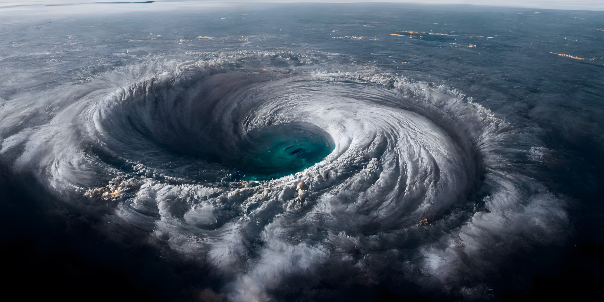

# Billion-dollar-disaster-US

The more time I spend in nature the more facinated I get with its beauty, wisdom and teachings. It's hard to put into words so I quote Albert Einstein, who said *Look deep into nature, and then you will understand everything better*. 

At the same time climate change is becoming real and threating all different lives on this plant. Respoonding to [Aaron Swartz](https://en.wikipedia.org/wiki/Aaron_Swartz)'s question- *What is the most important thing you could be working on in the world right now? And if you're not working on that, why aren't you?* I believe this is the most important thing right now.  

In this project I analyse deeply the most destructiv natural disasters happing in the US over the last decades. The main objective is to understand patterns and possilbe changes over time providing a sourcefull foundation for discussion or further research. 

On a practical side I showcase the whole process of a data visualisation project using the porgramming language JavaScript for data cleaning, EDA, plotting and the final dynamic visualisation with data provided by [NCEI](https://www.ncei.noaa.gov/access/billions/events/US/1980-2023?disasters[]=all-disasters). 

Have a look at the image below showing a hurricane, one of the most dangerous natural disasters. Some birds though fly directly into the eye of the hurricane, where it is surprisingly clam. 

## EDA

The first step is always to check your data and variable structure as well as general patterns and trends. For this purpose I used [arquero.js](https://uwdata.github.io/arquero/)  as a data processing library and [plot.js](https://observablehq.com/plot/) 
 as a plotting library. Please find the whole analysis and finding in this [Observable notebook](https://observablehq.com/@sandraviz/billion-dollar-disasters-arquero-js-plot-js?collection=@sandraviz/billion-dollar-disaster).

 

